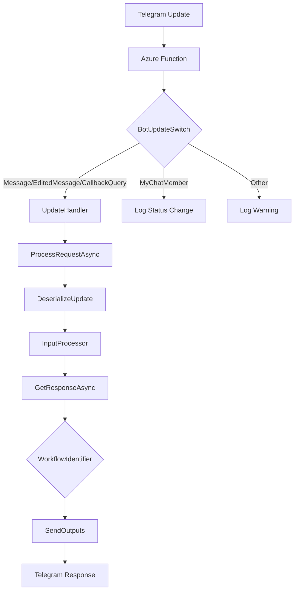

```mermaid
graph TD
    A[Telegram Update] --> B[Azure Function]
    B --> C{BotUpdateSwitch}
    C -->|Message/EditedMessage/CallbackQuery| D[UpdateHandler]
    C -->|MyChatMember| E[Log Status Change]
    C -->|Other| F[Log Warning]
    D --> G[ProcessRequestAsync]
    G --> H[DeserializeUpdate]
    H --> I[InputProcessor]
    I --> J[GetResponseAsync]
    J --> K{WorkflowIdentifier}
    K --> L[SendOutputs]
    L --> M[Telegram Response]
```
